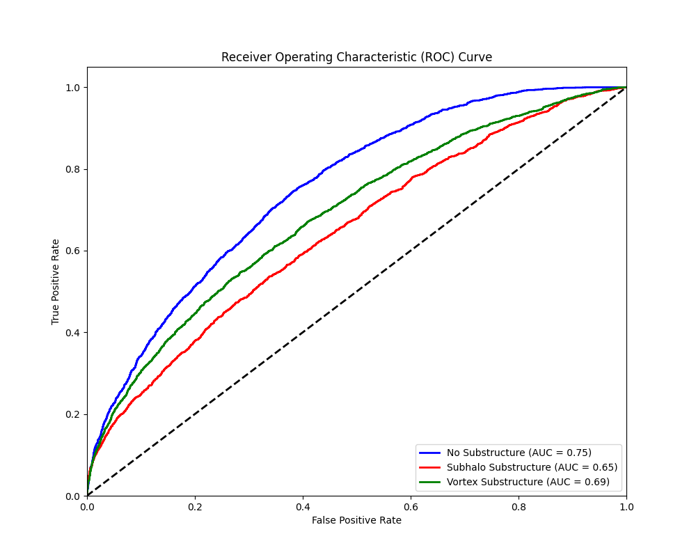
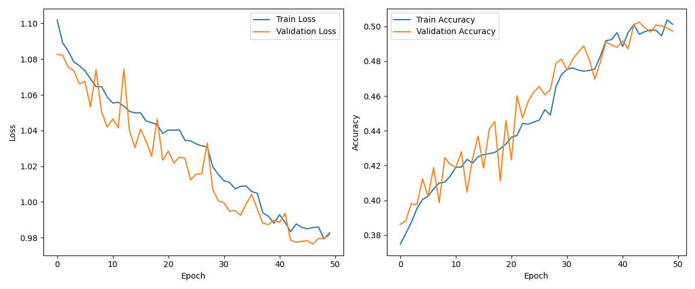

# Gravitational Lensing Substructure Classification

This repository contains a PyTorch implementation for classifying strong gravitational lensing images based on the type of substructure present. The model distinguishes between three classes:
1.  **No Substructure:** Lensed images without significant substructure.
2.  **Subhalo Substructure:** Lensed images indicating the presence of dark matter subhalos.
3.  **Vortex Substructure:** Lensed images indicating the presence of vortex substructure (often related to alternative dark matter models like scalar field dark matter).

The project utilizes transfer learning with a pre-trained ResNet50 model to achieve efficient and effective classification.

## Results

The model's performance is evaluated using Receiver Operating Characteristic (ROC) curves and Area Under the Curve (AUC) scores for each class on the validation set. The training progress is monitored via loss and accuracy curves.

### ROC Curve & AUC Scores

The ROC curve plots the True Positive Rate (TPR) against the False Positive Rate (FPR) at various threshold settings. The AUC provides an aggregate measure of performance across all possible classification thresholds.



*   **Interpretation:** The plot shows the trade-off between sensitivity (TPR) and specificity (1-FPR) for each class. Higher curves (closer to the top-left corner) indicate better performance. The AUC scores quantify this:
    *   No Substructure: AUC = 0.75
    *   Subhalo Substructure: AUC = 0.65
    *   Vortex Substructure: AUC = 0.69
    *   The dashed line represents a random classifier (AUC = 0.5).

### Training History

The training history shows the model's loss and accuracy on both the training and validation datasets over epochs.



*   **Interpretation:**
    *   **Loss:** The plot shows that both training and validation loss generally decrease over epochs, indicating that the model is learning. Some fluctuations are expected, especially with techniques like learning rate scheduling.
    *   **Accuracy:** Both training and validation accuracy generally increase, confirming the model's learning progress. The gap between training and validation curves can indicate the degree of overfitting.

## Approach

The core approach relies on **Transfer Learning** and **Fine-tuning**.

1.  **Dataset Handling:**
    *   A custom `LensingDataset` class loads `.npy` image files.
    *   It expects data organized into `train` and `val` sets, further divided by class (`no`, `sphere`, `vort`).
    *   Images are converted to PyTorch tensors. Single-channel images are duplicated across 3 channels to match the input requirements of the pre-trained ResNet model.
    *   **Data Augmentation:** Standard augmentations (Random Horizontal/Vertical Flips, Random Rotation) are applied to the training data to improve generalization.
    *   **Normalization:** Images are normalized using ImageNet's mean and standard deviation, as expected by the pre-trained ResNet model.

2.  **Model Architecture:**
    *   **Base Model:** A ResNet50 model pre-trained on the ImageNet dataset is used as the feature extractor.
    *   **Transfer Learning:** Instead of training a network from scratch, we leverage the features learned by ResNet50 on a large dataset (ImageNet), which are often useful for various computer vision tasks.
    *   **Fine-tuning:**
        *   **Layer Freezing:** Most of the early convolutional layers of ResNet50 are frozen (their weights are not updated during training) to preserve the general features learned from ImageNet. The code specifically unfreezes the last block (`layer4` according to the optimizer setup) and the final classifier.
        *   **Custom Classifier Head:** The original ResNet50 fully connected layer (designed for 1000 ImageNet classes) is replaced with a new sequence tailored for our 3-class problem:
            `Linear(2048 -> 1024) -> ReLU -> Dropout(0.5) -> Linear(1024 -> 3)`
            This includes a hidden layer, ReLU activation, and Dropout for regularization.

3.  **Training Process:**
    *   **Loss Function:** `CrossEntropyLoss` is used, suitable for multi-class classification.
    *   **Optimizer:** `Adam` optimizer is employed. **Differential Learning Rates** are used: a higher learning rate for the newly added classifier head (`fc`) and a lower learning rate for the unfrozen ResNet block (`layer4`). This allows the new layers to learn faster while only fine-tuning the deeper pre-trained layers more cautiously. `weight_decay` (L2 regularization) is also included.
    *   **Learning Rate Scheduling:** `ReduceLROnPlateau` scheduler monitors the validation loss and reduces the learning rate if the loss plateaus, helping the model converge more effectively.
    *   **Best Model Saving:** The model state dictionary with the lowest validation loss is saved during training.

4.  **Evaluation:**
    *   The model with the best validation performance is loaded for final evaluation.
    *   Predictions (class probabilities) are generated for the validation set.
    *   ROC curves and AUC scores are calculated for each class using a one-vs-rest approach.

## Requirements

*   Python 3.x
*   PyTorch (`torch`)
*   Torchvision (`torchvision`)
*   NumPy (`numpy`)
*   Matplotlib (`matplotlib`)
*   Scikit-learn (`sklearn`)
*   OS (`os`)
*   Itertools (`itertools`)

You can install the required Python packages using pip:
```bash
pip install torch torchvision numpy matplotlib scikit-learn
